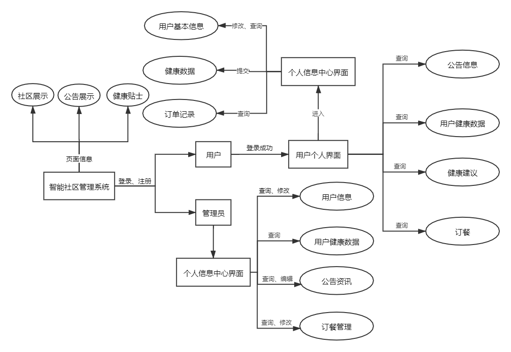
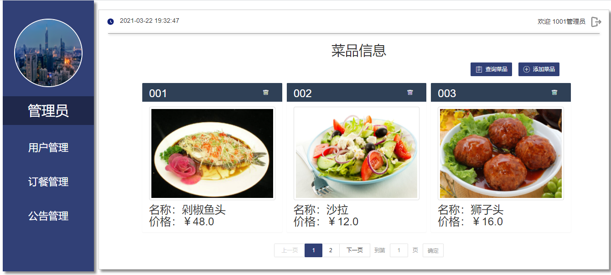
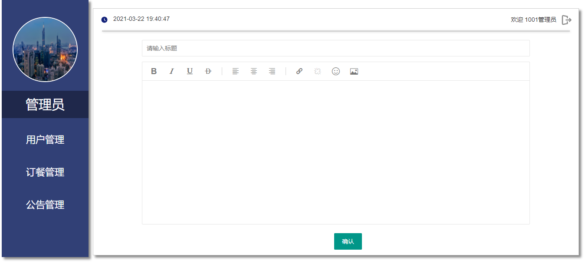

# **CommunityManagementSystem-ING-2020**
## **智能社区管理系统**
---
## About
此项目是基于layui构建的智能社区管理系统，由用户端和管理端组成，实现功能以达到便利于民的目的。 
 
## 目录结构 
├─css&emsp;//样式文件  
├─database&emsp;//数据库  
&nbsp;|&emsp;&emsp;├─database.sql&emsp;//数据库导入文件 
&nbsp;|&emsp;&emsp;└─[DATABASE.md](database/DATABASE.md)&emsp;//数据库说明  
├─html&emsp;//html页面  
├─images&emsp;//图片 
│&emsp;&emsp;└─imgUploads&emsp;//上传文件 
├─js&emsp;//javas 
├─layui&emsp;//layui开发包 
├─php&emsp;//脚本文件 
└─README.md&emsp;//说明文件 

## 功能说明
>* 登录注册：用户登录和注册，登录和注册都需要进行信息项校验，并且有成功和失败两种登录提示。  
>* 健康数据显示：登录后，可对当日个人健康数据（例如体温、血压、心率等）进行接入展示。可考虑数据卡片、图表可视化等呈现形式。可查询展示历史个人健康数据。
>* 智能健康评估：在已有个人健康数据的基础上，评估健康状况，并给出健康建议。评估健康状况可以建立一些简单规则，健康建议可存储在对应的数据库表里，从运动和饮食两个角度出发给予个性化方案。
>* 健康生活干预：根据个人健康评估得到的个性化方案，监督运动和每日食谱推荐，并提高订餐服务，支持浏览菜单、下单和订单查询服务，下单时不需要接入支付。
>* 公告资讯管理：对公告/资讯进行信息管理，除了一般的文本管理之外，还要包括图片、附件等内容管理。管理操作包括添加、编辑、删除和查询，并且访问该管理模块时能看见所有的公告/资讯列表，要求支持分页显示。
 

## 业务流程图

## 部分截图

 

  
